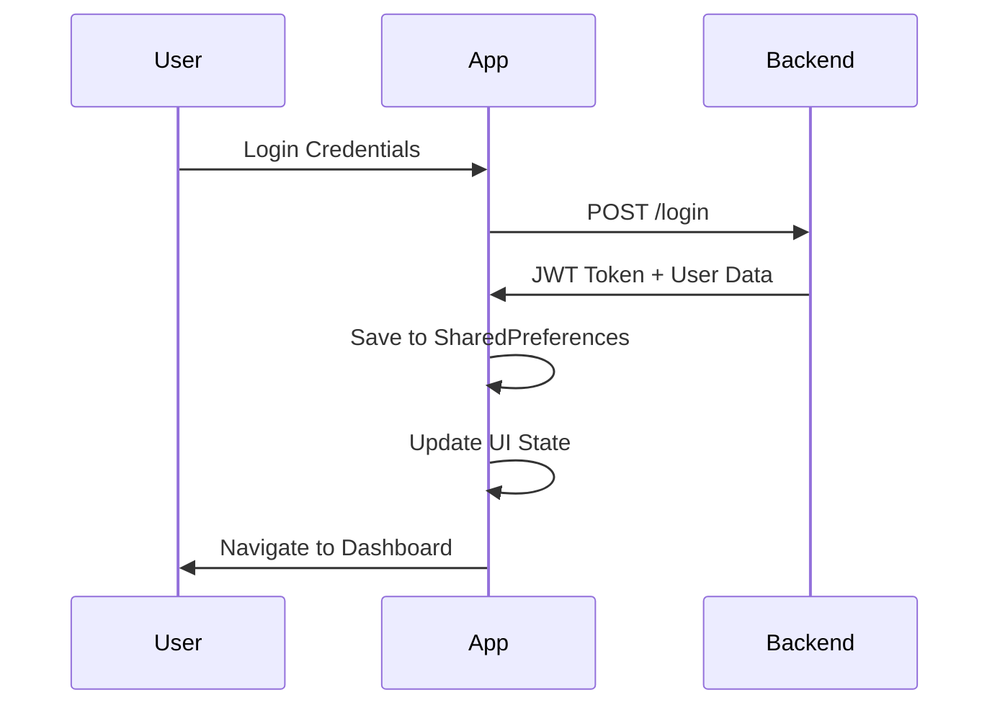
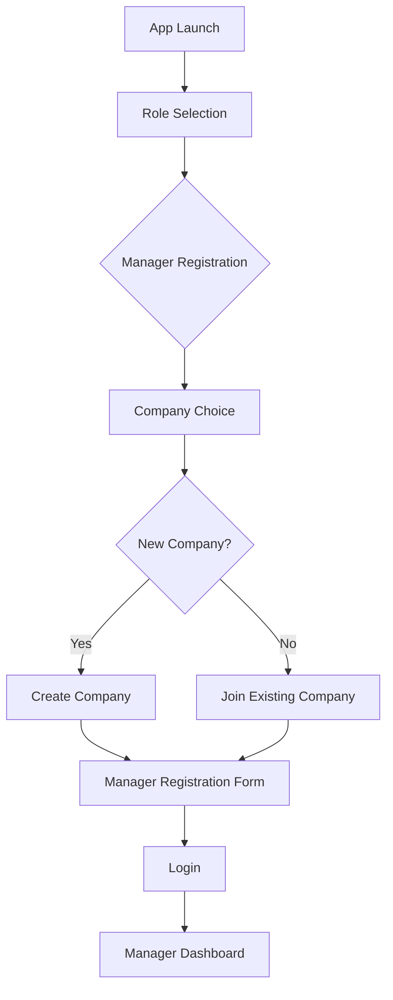
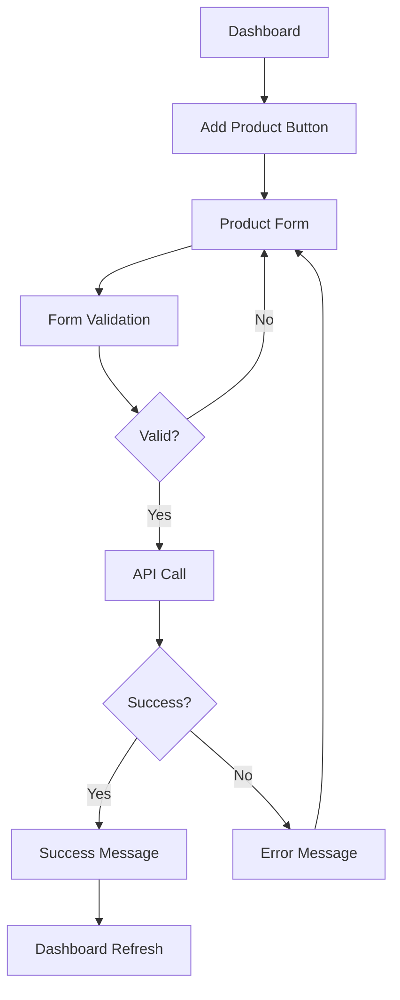
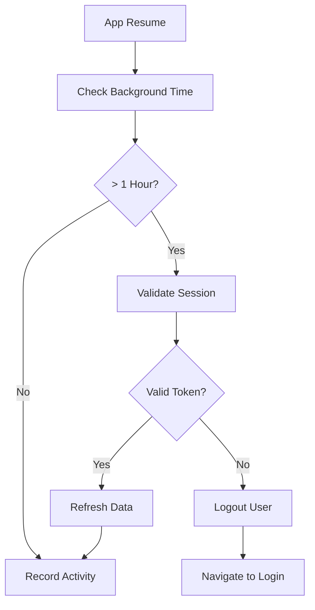

# Inventro - Inventory & Team Management System

## 📋 Overview

Inventro is a comprehensive Flutter-based inventory and team management system designed for companies to efficiently manage their inventory, track products, and coordinate team activities. The application serves two distinct user roles with role-based access control and features a robust authentication system backed by JWT tokens.

## 🏗️ Architecture

### **Design Pattern: MVVM with GetX**

The application follows a **Model-View-ViewModel (MVVM)** architecture pattern enhanced with GetX's reactive state management:

```
View (UI) ↔ Controller (ViewModel) ↔ Service (Model) ↔ API/Storage
```

### **Key Architectural Principles**
- **Separation of Concerns**: Clear separation between UI, business logic, and data layers
- **Reactive Programming**: Observable state management with automatic UI updates
- **Dependency Injection**: Lazy loading and proper lifecycle management
- **Route Protection**: Middleware-based authentication guards
- **Session Management**: Automatic token validation and recovery

## 👥 User Roles & Features

### **Admin/Manager Role**
- ✅ Company registration and management
- ✅ Employee onboarding and management
- ✅ Product inventory tracking and management
- ✅ Task assignment and monitoring
- ✅ Dashboard analytics and reporting
- ✅ Profile and company settings management

### **Employee Role**
- ✅ Secure login with PIN-based authentication
- ✅ View assigned products and tasks
- ✅ Limited product operations
- ✅ Personal dashboard with relevant information

## 🛠️ Technology Stack

### **Core Technologies**
| Technology | Purpose | Version |
|------------|---------|---------|
| **Flutter** | Cross-platform mobile framework | Latest |
| **Dart** | Programming language | Latest |
| **GetX** | State management, DI, routing | ^4.6.5 |
| **HTTP** | API communication | ^1.1.0 |
| **SharedPreferences** | Local data persistence | ^2.2.2 |

### **State Management**
- **GetX Reactive Programming**: Observable variables with `.obs` extension
- **Controller Lifecycle**: Automatic disposal and memory management
- **Reactive UI Updates**: `Obx()` widgets for efficient rebuilds

## 📁 Project Structure

```
lib/
├── main.dart                          # Entry point with lifecycle management
├── app/
│   ├── routes/
│   │   ├── app_routes.dart           # Route constants and definitions
│   │   └── app_pages.dart            # Route configuration & lazy bindings
│   ├── modules/
│   │   └── auth/
│   │       ├── controller/           # Business logic & state management
│   │       │   ├── auth_controller.dart
│   │       │   ├── dashboard_controller.dart
│   │       │   ├── employee_list_controller.dart
│   │       │   ├── add_product_controller.dart
│   │       │   └── ...
│   │       ├── views/               # UI screens separated by role
│   │       │   ├── manager/         # Manager-specific screens
│   │       │   │   ├── dashboard.dart
│   │       │   │   ├── add_product_screen.dart
│   │       │   │   ├── employee_list_screen.dart
│   │       │   │   └── widgets/     # Manager UI components
│   │       │   ├── employee/        # Employee-specific screens
│   │       │   │   ├── employee_dashboard.dart
│   │       │   │   └── employee_login_screen.dart
│   │       │   ├── splash_screen.dart
│   │       │   └── role_selection_screen.dart
│   │       └── bindings/            # Dependency injection configs
│   ├── data/
│   │   ├── services/               # API & business services
│   │   │   ├── auth_service.dart
│   │   │   ├── product_service.dart
│   │   │   ├── company_service.dart
│   │   │   └── session_recovery_service.dart
│   │   └── models/                 # Data models
│   │       ├── user_model.dart
│   │       ├── product_model.dart
│   │       └── company_model.dart
│   ├── utils/                      # Utilities & helpers
│   │   ├── safe_navigation.dart
│   │   ├── responsive_utils.dart
│   │   └── safe_controller_base.dart
│   └── middleware/                 # Route protection
│       ├── auth_middleware.dart
│       └── guest_middleware.dart
```

## 🔧 State Management Implementation

### **GetX Observable Pattern**

```dart
// Controller example
class DashboardController extends GetxController {
  // Observable variables
  final isLoading = false.obs;                    // Boolean observable
  final products = <ProductModel>[].obs;          // List observable
  final user = Rxn<UserModel>();                  // Nullable observable
  final searchQuery = ''.obs;                     // String observable
  
  // Reactive computed properties
  List<ProductModel> get filteredProducts => products.where((product) =>
    product.partNumber.toLowerCase().contains(searchQuery.value.toLowerCase())
  ).toList();
  
  // Method to update state
  void updateProducts(List<ProductModel> newProducts) {
    products.value = newProducts;
    products.refresh(); // Force UI update
  }
}
```

### **Reactive UI Updates**

```dart
// Automatic UI updates when state changes
Obx(() => controller.isLoading.value 
  ? const CircularProgressIndicator() 
  : ProductGridView(products: controller.filteredProducts)
)
```

## 🗺️ Navigation & Routing

### **Named Route System**

```dart
// Route definitions
abstract class AppRoutes {
  static const String splash = '/splash';
  static const String roleSelection = '/role-selection';
  static const String login = '/login';
  static const String dashboard = '/dashboard';
  static const String addProduct = '/add-product';
  static const String employeeDashboard = '/employee-dashboard';
}
```

### **Protected Routes with Middleware**

```dart
// Route protection example
GetPage(
  name: AppRoutes.dashboard,
  page: () => const ManagerDashboard(),
  binding: DashboardBinding(), // Lazy loading
  middlewares: [AuthMiddleware()], // Authentication guard
),
```

### **Safe Navigation Utilities**

```dart
class SafeNavigation {
  static void safeToNamed(String route, {dynamic arguments}) {
    try {
      if (_isProtectedRoute(route)) {
        final authController = Get.find<AuthController>();
        if (!_isAuthenticated(authController)) {
          Get.offAllNamed('/role-selection');
          return;
        }
      }
      Get.toNamed(route, arguments: arguments);
    } catch (e) {
      _handleNavigationError(e);
    }
  }
}
```

## 🔐 Authentication & Security

### **JWT-Based Authentication Flow**



### **Session Management**

The application implements sophisticated session management:

1. **Automatic Token Validation**: Checks token validity on app resume
2. **Session Recovery**: Validates and refreshes expired sessions
3. **Background Time Tracking**: Monitors app background duration
4. **Secure Storage**: Encrypted token storage in SharedPreferences

```dart
// Session validation example
Future<bool> validateAndRecoverSession() async {
  try {
    final authController = Get.find<AuthController>();
    final token = authController.user.value?.token;
    
    if (token == null) return false;
    
    // Validate with backend
    final isValid = await _authService.validateToken(token);
    
    if (!isValid) {
      await authController.logout();
      return false;
    }
    
    return true;
  } catch (e) {
    return false;
  }
}
```

### **Role-Based Access Control**

- **Route Protection**: Middleware validates user role before navigation
- **UI Conditional Rendering**: Different interfaces for managers vs employees
- **API Authorization**: Role-specific endpoint access

## 🔗 API Integration

### **RESTful API Architecture**

The app integrates with a FastAPI backend through RESTful endpoints:

| Endpoint | Method | Purpose | Auth Required |
|----------|--------|---------|---------------|
| `/login` | POST | User authentication | ❌ |
| `/products` | GET | Fetch all products | ✅ |
| `/products` | POST | Create new product | ✅ |
| `/products/{id}` | PUT | Update product | ✅ |
| `/products/{id}` | DELETE | Delete product | ✅ |
| `/employees` | GET | Fetch employees | ✅ |
| `/employees` | POST | Create employee | ✅ |
| `/companies/{id}` | GET | Get company details | ✅ |
| `/companies` | POST | Create company | ✅ |

### **Service Layer Implementation**

```dart
class ProductService {
  final String baseUrl = 'https://backend.tecsohub.com/';
  
  Future<Map<String, String>> getAuthHeaders() async {
    final authController = Get.find<AuthController>();
    final token = authController.user.value?.token;
    
    if (token?.isEmpty ?? true) {
      throw Exception('Authentication required');
    }
    
    return {
      'Content-Type': 'application/json',
      'Authorization': 'Bearer $token',
    };
  }
  
  Future<List<Map<String, dynamic>>> getProducts() async {
    final headers = await getAuthHeaders();
    final response = await http.get(
      Uri.parse('${baseUrl}products'),
      headers: headers,
    ).timeout(const Duration(seconds: 30));
    
    if (response.statusCode == 200) {
      return List<Map<String, dynamic>>.from(jsonDecode(response.body));
    } else {
      throw Exception('Failed to load products: ${response.statusCode}');
    }
  }
}
```

## 💾 Data Persistence

### **Local Storage Strategy**

```dart
// User data persistence
Future<void> saveUserToPrefs(UserModel user) async {
  final prefs = await SharedPreferences.getInstance();
  
  // Basic user data
  await prefs.setString('user_name', user.name);
  await prefs.setString('user_email', user.email);
  await prefs.setString('user_token', user.token);
  await prefs.setString('user_role', user.role);
  
  // Company data (if available)
  if (user.company != null) {
    await prefs.setString('user_company', jsonEncode(user.company!.toJson()));
  }
  
  // Session tracking
  await prefs.setString('login_timestamp', DateTime.now().toIso8601String());
}
```

### **Data Models**

```dart
// User model example
class UserModel {
  final String name;
  final String email;
  final String role;
  final String token;
  final CompanyModel? company;
  final String? phone;
  final String? profilePicture;
  
  UserModel({
    required this.name,
    required this.email,
    required this.role,
    required this.token,
    this.company,
    this.phone,
    this.profilePicture,
  });
  
  factory UserModel.fromJson(Map<String, dynamic> json) {
    return UserModel(
      name: json['name'] ?? '',
      email: json['email'] ?? '',
      role: json['role'] ?? 'employee',
      token: json['token'] ?? '',
      company: json['company'] != null 
        ? CompanyModel.fromJson(json['company']) 
        : null,
      phone: json['phone'],
      profilePicture: json['profile_picture'],
    );
  }
}
```

## 🎨 UI/UX Design System

### **Design Principles**
- **Consistent Visual Language**: Unified color scheme and typography
- **Responsive Design**: Adaptive layouts for different screen sizes
- **Accessibility**: Screen reader support and high contrast options
- **Smooth Animations**: Micro-interactions and page transitions

### **Color Palette**

```dart
// App-wide color scheme
static const List<Color> gradientColors = [
  Color(0xFF4A00E0), // Primary Purple
  Color(0xFF00C3FF), // Secondary Blue  
  Color(0xFF8F00FF), // Accent Magenta
];

// Semantic colors
static const Color successColor = Color(0xFF28A745);
static const Color errorColor = Color(0xFFDC3545);
static const Color warningColor = Color(0xFFFFC107);
```

### **Reusable Components**

```dart
// Example reusable component
class DashboardCard extends StatelessWidget {
  final String title;
  final Widget child;
  final EdgeInsets? padding;
  
  const DashboardCard({
    required this.title,
    required this.child,
    this.padding,
  });
  
  @override
  Widget build(BuildContext context) {
    return Container(
      padding: padding ?? const EdgeInsets.all(24),
      decoration: BoxDecoration(
        color: Colors.white,
        borderRadius: BorderRadius.circular(20),
        boxShadow: [
          BoxShadow(
            color: Colors.black.withOpacity(0.05),
            blurRadius: 10,
            offset: const Offset(0, 4),
          ),
        ],
      ),
      child: Column(
        crossAxisAlignment: CrossAxisAlignment.start,
        children: [
          Text(title, style: Theme.of(context).textTheme.headlineSmall),
          const SizedBox(height: 16),
          child,
        ],
      ),
    );
  }
}
```

### **Responsive Layout System**

```dart
class ResponsiveUtils {
  static double getPadding(BuildContext context, {double factor = 1.0}) {
    final screenWidth = MediaQuery.of(context).size.width;
    return (screenWidth * 0.04 * factor).clamp(16.0, 32.0);
  }
  
  static bool isSmallScreen(BuildContext context) {
    return MediaQuery.of(context).size.width < 600;
  }
  
  static bool isTablet(BuildContext context) {
    final screenWidth = MediaQuery.of(context).size.width;
    return screenWidth >= 600 && screenWidth < 1024;
  }
}
```

## 🔄 Critical Application Flows

### **1. Manager Onboarding Flow**



### **2. Product Management Flow**



### **3. Session Management Flow**



## 🚨 Error Handling Strategy

### **Multi-Layer Error Handling**

1. **Network Layer**: HTTP errors, timeouts, connectivity issues
2. **Service Layer**: Data parsing, validation, business logic errors
3. **Controller Layer**: State management, user interaction errors
4. **UI Layer**: User-friendly error messages and recovery options

```dart
// Comprehensive error handling example
Future<void> fetchProducts() async {
  try {
    isLoading.value = true;
    hasError.value = false;
    
    final productList = await _productService.getProducts();
    products.value = productList.map((json) => ProductModel.fromJson(json)).toList();
    
  } on TimeoutException {
    _handleError('Request timed out. Please check your connection.');
  } on FormatException {
    _handleError('Invalid data received from server.');
  } on Exception catch (e) {
    _handleError(_getErrorMessage(e));
  } finally {
    isLoading.value = false;
  }
}

void _handleError(String message) {
  hasError.value = true;
  errorMessage.value = message;
  
  SafeNavigation.safeSnackbar(
    title: 'Error',
    message: message,
    backgroundColor: Colors.red.withOpacity(0.1),
    colorText: Colors.red[800],
  );
}
```

## 🧪 Testing Strategy

### **Unit Testing**
- Controller logic testing
- Service layer testing
- Model validation testing

### **Widget Testing**
- UI component testing
- Navigation flow testing
- User interaction testing

### **Integration Testing**
- API integration testing
- Authentication flow testing
- Data persistence testing

## 📱 App Lifecycle Management

The application implements sophisticated lifecycle management in `main.dart`:

```dart
class AppLifecycleObserver extends StatefulWidget {
  // Monitors app state changes
  // Handles session validation on resume
  // Manages background time tracking
  // Implements data refresh strategies
}
```

### **Key Lifecycle Events**
- **App Resume**: Validates session, refreshes data
- **App Pause**: Records timestamp, saves state
- **App Inactive**: Saves current activity state

## 🔧 Development Setup

### **Prerequisites**
- Flutter SDK (3.0+)
- Dart SDK (3.0+)
- Android Studio / VS Code
- Git

### **Installation Steps**

```bash
# Clone the repository
git clone <repository-url>
cd inventro

# Install dependencies
flutter pub get

# Run the app
flutter run
```

### **Environment Configuration**

```dart
// Create lib/config/environment.dart
class Environment {
  static const String baseUrl = 'https://backend.tecsohub.com/';
  static const String appName = 'Inventro';
  static const Duration sessionTimeout = Duration(hours: 24);
}
```

## 🚀 Performance Optimizations

### **Current Optimizations**
- **Lazy Loading**: Controllers loaded only when needed
- **Reactive Updates**: UI updates only when data changes
- **Memory Management**: Proper disposal of controllers and listeners
- **Efficient Search**: Debounced search with filtered observables

### **Recommended Improvements**
- **Pagination**: Implement for large product lists
- **Image Caching**: Cache product images for offline viewing
- **Background Sync**: Sync data when app comes to foreground
- **Offline Support**: Local database for critical data

## 🐛 Known Issues & Limitations

### **Current Limitations**
1. **No Offline Support**: Requires internet connectivity
2. **Limited Error Recovery**: Some API failures require app restart
3. **No Real-time Updates**: Data refreshes only on manual action
4. **Single Language**: Only English language support

### **Planned Improvements**
1. **SQLite Integration**: Local database for offline functionality
2. **WebSocket Support**: Real-time data updates
3. **Multi-language Support**: Internationalization (i18n)
4. **Advanced Analytics**: User behavior tracking and insights

## 📚 Key Dependencies

```yaml
dependencies:
  flutter:
    sdk: flutter
  get: ^4.6.5                    # State management & routing
  http: ^1.1.0                   # HTTP client
  shared_preferences: ^2.2.2     # Local storage
  path: ^1.8.3                   # File path utilities

dev_dependencies:
  flutter_test:
    sdk: flutter
  flutter_lints: ^3.0.0         # Linting rules
```

## 🤝 Contributing

### **Code Style Guidelines**
- Follow Dart/Flutter style guide
- Use meaningful variable and function names
- Comment complex business logic
- Maintain consistent file structure

### **Git Workflow**
1. Create feature branch from `main`
2. Implement changes with proper testing
3. Submit pull request with detailed description
4. Code review and approval process

## 📄 License

This project is licensed under the MIT License - see the LICENSE file for details.

## 📞 Support

For technical support or questions:
- Create an issue in the repository
- Contact the development team
- Review documentation and code comments

---

**Built with ❤️ using Flutter & GetX**
